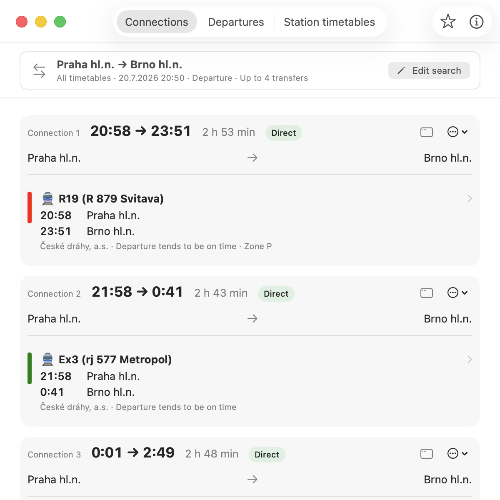

# 🌰 Kaštan


Kaštan provides occasional personal [IDOS](https://idos.cz/en/) queries as a native macOS app, a Swift CLI,
an importable Swift library, and a local MCP server.



It uses publicly reachable IDOS web endpoints and parses returned HTML, so it is not a stable or guaranteed
data API.

## Components

- [macOS app](docs/macos-app.md) — native SwiftUI connection and station-board searches.
- [CLI](docs/cli.md) — cross-platform terminal access with text, Markdown, JSON, and iCalendar output.
- [Swift library](docs/swift-library.md) — the shared `Kastan` product used by every interface.
- **MCP server** — read-only Kaštan tools for local MCP clients.

## Quick Start

The package requires Git and Swift 6.3 or newer.

```sh
git clone https://github.com/Glutexo/kastan.git
cd kastan
swift test
swift run kastan Praha Brno --time 12:00
```

Platform-specific setup, all commands, output formats, language selection, and stop aliases are documented in
the [CLI guide](docs/cli.md).

Open the native app in Xcode and run the shared `KastanApp` scheme:

```sh
open KastanApp/KastanApp.xcodeproj
```

See the [macOS app guide](docs/macos-app.md) for requirements, features, and command-line build instructions.

## MCP Server

The read-only `kastan-mcp` server lives in a separate Swift package and communicates over standard input and
output using the official Swift MCP SDK.

```sh
swift build --package-path MCPServer -c release
swift build --package-path MCPServer -c release --show-bin-path
```

Configure an MCP client to launch the resulting `kastan-mcp` executable. The server exposes tools for place
suggestions, station search, connections, departures, service details, and timetable discovery. It requires
macOS 13 or newer, or Linux.

Clients that use a JSON server map commonly accept an entry shaped like this:

```json
{
  "mcpServers": {
    "kastan": {
      "command": "/absolute/path/to/kastan-mcp"
    }
  }
}
```

The server advertises `suggest_places`, `search_stations`, `find_connections`, `find_departures`,
`get_service_detail`, and `list_timetables`. Query tools accept timetable aliases, English catalog names, or
IDOS URL slugs; service details also accept English or Czech output. Results include readable JSON, structured
MCP content, and matching output schemas. Limits default to 8 for suggestions, stations, and departures, and 5
for connections; callers can request up to 20 results.

## Development

```sh
swift build
swift test
swift test --package-path MCPServer
xcodebuild test -project KastanApp/KastanApp.xcodeproj -scheme KastanApp -destination 'platform=macOS'
```

GitHub Actions runs all three test suites for changes to `main` and for pull requests.

## License

Kaštan is dedicated to the public domain under [CC0 1.0 Universal](LICENSE).
