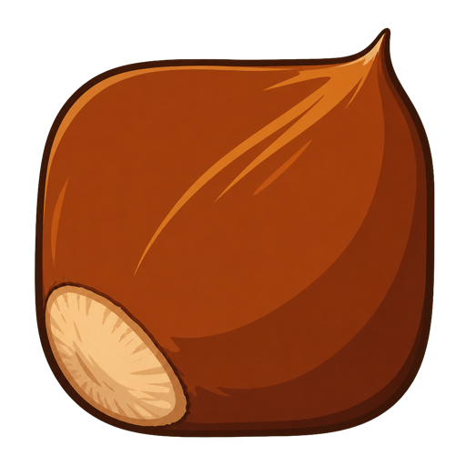
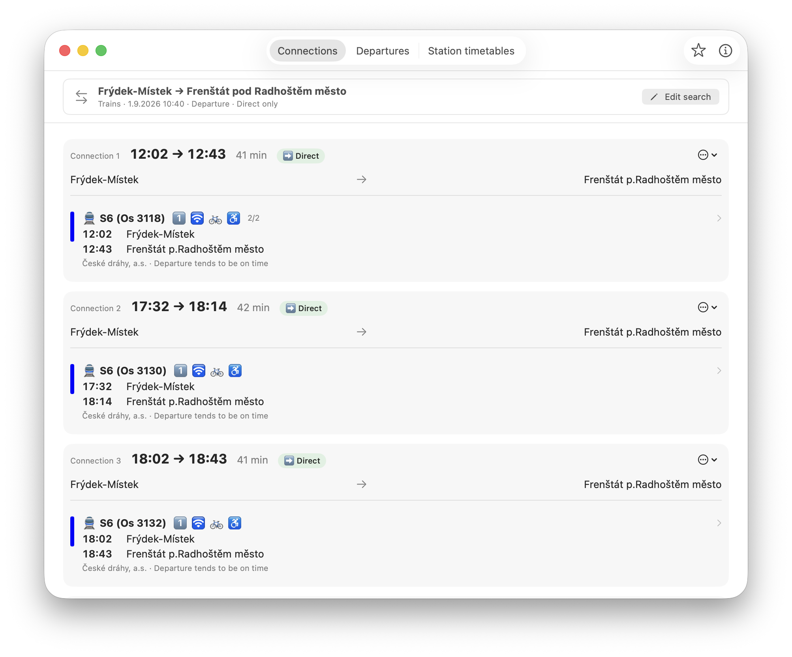

# 🌰 Kaštan



Kaštan is an open-source companion for occasional personal [IDOS](https://idos.cz/en/) searches. Use it as a
native macOS app or from a terminal, or integrate its search engine as a Swift library or local or remote MCP
server.



Kaštan reads publicly reachable IDOS web pages. It is intended for personal, low-frequency use rather than as
a stable or guaranteed data API.

## Choose How to Use Kaštan

- [macOS app](docs/macos-app.md) — search connections, station boards, and MHD station timetables in a native app.
- [CLI](docs/cli.md) — run the same searches on macOS, Windows, or Linux and choose human-readable or structured output.
- [Swift library](docs/swift-library.md) — build IDOS search features into a Swift project.
- [MCP server](docs/mcp-server.md) — give local or OAuth-protected remote MCP clients read-only access to Kaštan
  searches.

## Quick Start

Run the prebuilt Linux CLI image with Docker:

```sh
docker run --rm ghcr.io/glutexo/kastan-cli:latest Praha Brno --time 12:00
```

The [container guide](docs/containers.md) covers stable image tags, persistent CLI aliases, and the separate MCP
image.

For a native command-line build, install Git and Swift 6.3 or newer:

```sh
git clone https://github.com/Glutexo/kastan.git
cd kastan
swift test
swift run kastan Praha Brno --time 12:00
```

To try the native app, open the Xcode project and run the shared `KastanApp` scheme:

```sh
open KastanApp/KastanApp.xcodeproj
```

## Documentation

README stays focused on getting started. The [complete documentation](docs/README.md) contains platform setup,
full feature descriptions, every CLI command, the Swift API, and MCP configuration and tool behavior.

## Development

On macOS, the Makefile provides the common build, test, and packaging workflow for the Swift package, MCP server,
and app:

```sh
make build
make test
make
```

`make` writes a universal macOS DMG and a ZIP of the committed buildable sources to `dist/`. Run `make help`
to list the individual build, test, and archive targets. The CLI and MCP guides retain their platform-specific
commands for contributors working without Xcode. GitHub Actions runs all three test suites for changes to `main`
and for pull requests. The [macOS guide](docs/macos-app.md#create-download-archives) documents archive contents and
the signing limitation of locally generated builds.

## Why Kaštan?

*Kaštan* means *chestnut* in Czech. In Czech public-transport slang, the same word is also used for a passenger.
